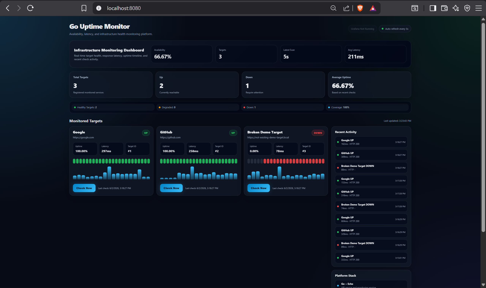

<h1 align="center">go-uptime-monitor</h1>

<p align="center">
  Self-hosted uptime monitoring service built with Go, SQLite, Docker, Prometheus metrics, and webhook alerts.
</p>

<p align="center">
  
  
  
  
</p>

---

## Portfolio Context

This project is part of a DevOps and SysAdmin portfolio lab:

- `go-uptime-monitor` is the application layer: API, dashboard, persistence, health checks, metrics, and alerting.
- [`ansible-server-bootstrap`](https://github.com/marquisccel/ansible-server-bootstrap) is the infrastructure layer: server hardening, Docker installation, Nginx reverse proxy, firewall rules, Node Exporter, and automated app deployment.

Together, both repositories demonstrate an end-to-end workflow: build a service, package it as a container, expose operational endpoints, then deploy it onto a hardened Linux server with automation.

## What It Does

- Checks a list of URLs on a scheduled interval.
- Stores check history, HTTP status code, latency, and up/down state in SQLite.
- Provides a built-in dashboard at `/`.
- Exposes a REST API for target management and history lookup.
- Exposes `/metrics` for Prometheus scraping.
- Provides `/healthz` for container and reverse-proxy health checks.
- Sends Slack or Discord webhook alerts when a target goes down or recovers.
- Uses a 5-minute alert cooldown per target to reduce alert noise.
- Validates input for required names, valid URLs, and supported `http` / `https` schemes.

## Dashboard



## Architecture

```text
User / Browser
    |
    | HTTP
    v
Go Uptime Monitor
    |-- Web dashboard: /
    |-- REST API: /api/v1/*
    |-- Health check: /healthz
    |-- Prometheus metrics: /metrics
    |
    | scheduled checks
    v
Monitored URLs

SQLite volume stores targets and check history.
Webhook integration sends downtime and recovery alerts.
```

## Tech Stack

| Area | Implementation |
|------|----------------|
| Language | Go 1.22 |
| Web framework | Echo |
| Storage | SQLite |
| Metrics | Prometheus client |
| Packaging | Docker, Docker Compose |
| Alerts | Slack / Discord webhook |
| Deployment target | Linux server via Ansible |

## Quick Start

### Option A: Pull from GHCR

```bash
docker run -d \
  --name uptime-monitor \
  -p 127.0.0.1:8080:8080 \
  -e CHECK_INTERVAL=60 \
  -v uptime_data:/data \
  ghcr.io/marquisccel/go-uptime-monitor:latest
```

Open `http://localhost:8080`.

### Option B: Docker Compose

```bash
git clone https://github.com/marquisccel/go-uptime-monitor
cd go-uptime-monitor
cp .env.example .env
docker compose up -d
```

Open `http://localhost:8080`.

### Option C: Run Locally

Requires Go 1.22+.

```bash
git clone https://github.com/marquisccel/go-uptime-monitor
cd go-uptime-monitor
go build -o bin/monitor ./cmd/monitor
./bin/monitor
```

## Add a Target

```bash
curl -X POST http://localhost:8080/api/v1/targets \
  -H "Content-Type: application/json" \
  -d '{"name": "Example", "url": "https://example.com", "interval": 60}'
```

Trigger an immediate check:

```bash
curl -X POST http://localhost:8080/api/v1/targets/1/check
```

## API Reference

| Method | Path | Description |
|--------|------|-------------|
| `GET` | `/api/v1/targets` | List monitored targets |
| `POST` | `/api/v1/targets` | Add a target |
| `DELETE` | `/api/v1/targets/:id` | Remove a target |
| `GET` | `/api/v1/targets/:id/history` | Return latest check history |
| `POST` | `/api/v1/targets/:id/check` | Run a manual check |
| `GET` | `/api/v1/status` | Return 24-hour uptime summary |
| `GET` | `/metrics` | Prometheus metrics |
| `GET` | `/healthz` | Health check |

## Configuration

Configuration is loaded from environment variables or `.env`.

| Variable | Default | Description |
|----------|---------|-------------|
| `PORT` | `8080` | HTTP server port |
| `DB_PATH` | `/data/uptime.db` | SQLite database path |
| `CHECK_INTERVAL` | `60` | Default check interval in seconds |
| `CHECK_TIMEOUT` | `10` | HTTP request timeout in seconds |
| `WEBHOOK_URL` | empty | Slack or Discord webhook URL |

## Prometheus Metrics

| Metric | Type | Description |
|--------|------|-------------|
| `uptime_check_duration_seconds` | Histogram | HTTP check latency by target |
| `uptime_check_up` | Gauge | `1` for up, `0` for down |
| `uptime_checks_total` | Counter | Total checks by target |

## Input Validation

`POST /api/v1/targets` rejects invalid payloads with `400 Bad Request`.

| Rule | Error response |
|------|----------------|
| Missing `name` | `{"error": "name is required"}` |
| Missing `url` | `{"error": "url is required"}` |
| URL is not `http` or `https` | `{"error": "url must be a valid http or https URL"}` |

## Operational Notes

- The container stores SQLite data in `/data`, which should be mounted as a volume.
- `/healthz` can be used by Docker, Nginx, or external uptime checks.
- `/metrics` can be scraped by Prometheus or a compatible monitoring system.
- Webhook alerts include downtime and recovery events, with cooldown handling to avoid repeated spam.

## Deployment

This app is designed to be deployed by [`ansible-server-bootstrap`](https://github.com/marquisccel/ansible-server-bootstrap). The Ansible project provisions an Ubuntu server, installs Docker, configures Nginx and UFW, installs Node Exporter, then pulls and runs this container image.

## Project Structure

```text
go-uptime-monitor/
|-- cmd/monitor/              # Application entry point
|-- internal/alert/           # Webhook alert logic
|-- internal/checker/         # URL checking and scheduler
|-- internal/config/          # Environment-based configuration
|-- internal/handler/         # Echo routes and request handlers
|-- internal/metrics/         # Prometheus metric registration
|-- internal/model/           # Domain models
|-- internal/repository/      # SQLite repository layer
|-- web/                      # Built-in dashboard
|-- docs/                     # Screenshots
|-- Dockerfile
|-- docker-compose.yml
|-- Makefile
`-- README.md
```

## Make Commands

```bash
make build       # Build binary to bin/monitor
make run         # Run with go run
make test        # Run tests
make docker      # Build Docker image
make docker-run  # Start with Docker Compose
```

## What This Demonstrates

- Backend service design with Go.
- Containerized application delivery.
- Persistent storage with SQLite volume mapping.
- REST API and dashboard exposure.
- Prometheus-ready operational metrics.
- Basic production readiness through health checks, alerting, and infrastructure automation.

## Roadmap

- Add authentication for dashboard and API access.
- Add Grafana dashboard examples for exported metrics.
- Add GitHub Actions workflow for build, test, and image publishing.
- Add automated tests for handlers, checker logic, and repository behavior.

---

<p align="center">
  <i>Application layer for a DevOps and SysAdmin portfolio lab by Ega Yurcel Satriaji.</i>
</p>
